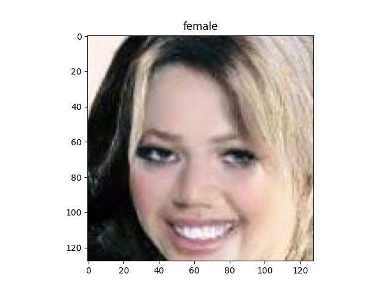
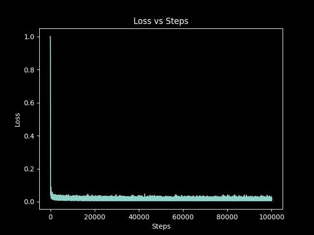

# Diffusion-Transformers


## CelebA
* \
   The CelebA dataset consists of celebrity images, such as the example shown above.
* The model has been trained for only 100K steps so far. Ideally, it should be trained for 400K steps to improve the quality of generated images. While the current model is undertrained, the generated images are still decent. Check them out below.

### Generated Images
* Run the following command to generate images:
```python
python generate.py --labels female male female female --ema True
```
Here are some sample images generated by the model:
* 
* 
* 
* 
* 
* 
* 

### Training Insights
* 
* Run the following file to get the graph of `loss` vs `learning_rate` to select the best `max_lr`:
  ```python
  python torch_src/config.py
  ```
  
  You can see that "log10 learning rates" after `-4.0 (lr=1e-4)` are unstable. When using a max_lr=3e-4, the training loss spiked, and the model forgot everything midway through training
  ```python
  python train.py
  ```
* ***If you have GPUs and can train this model for 400k steps, please edit the generate.py file to include a download link to your weights, and send a pull request. I’d be happy to incorporate it!***
* A GIF showing images as the training progress is displayed below
 


## MNIST Experiment
* The MNIST dataset is used as a test case for the diffusion model.


### Training on MNIST
* To train the model on MNIST, run:
   ```python
   python torch_src/diffusion_transformer.py
   ```
* Additionally, check out the jax_mnist_diffusion_transformer.ipynb notebook for a JAX version of the model:


## Latent-Diffusion Models
* In this paper, we apply DiTs to latent space, although they could be applied to pixel space without modification as well

## Classifier-free Guidance


## DiTs
* Following patchify, we apply standard ViT frequency-based positional embeddings (the sine-cosine version) to all input tokens


### DiT block design
We explore four variants of transformer blocks that process conditional inputs differently
* ***In-context conditioning:*** We simply append the vector
embeddings of t and c as two additional tokens in
the input sequence, treating them no differently from
the image tokens. This is similar to cls tokens in
ViTs, and it allows us to use standard ViT blocks without
modification.
* ***Cross-attention block:*** We concatenate the embeddings
of t and c into a length-two sequence, separate from
the image token sequence. The transformer block is
modified to include an additional multi-head crossattention
layer following the multi-head self-attention
block, similar to the original design from Vaswani et
al., and also similar to the one used by LDM for
conditioning on class labels. Cross-attention adds the
most Gflops to the model, roughly a 15% overhead.
* ***Adaptive layer norm (adaLN) block:*** We explore replacing standard layer norm layers in transformer blocks with adaptive layer norm (adaLN). Rather than directly learn dimensionwise scale and shift parameters $\gamma$ and $\beta$, we regress
them from the sum of the embedding vectors of $t$ and
$c$. Of the three block designs we explore, adaLN adds
the least Gflops and is thus the most compute-efficient
* ***adaLN-Zero block*** : Zero-initializing the final batch norm scale factor in each block accelerates large-scale training in the supervised learning setting. Diffusion U-Net models use a similar initialization strategy, zero-initializing the final convolutional layer in each block prior to any residual connections. We explore a modification of the adaLN DiT block which does the same. In addition to regressing $\gamma$ and $\beta$, we also regress dimensionwise scaling parameters $\alpha$ that are applied immediately prior to any residual connections within the DiT block

## Training Setup
* We initialize the final linear layer with zeros and otherwise use standard weight initialization techniques from ViT
* AdamW
* We use a constant learning rate of $1\times 10^{-4}$, no weight decay and a batch size of $256$
* Exponential moving average (EMA) of DiT weights over training with a decay of $0.9999$
* The VAE encoder has a downsample factor of 8, given an
RGB image $x$ with shape $256 \times 256 \times 3$, $z = E(x)$ has shape $32 \times 32 \times 4$
* $t_{\max} = 1000$ linear variance schedule ranging from $1 \times 10^{-4}$ to $2 \times 10^{-2}$
