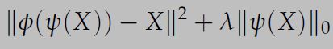

# Variational Auto-Encoder (VAE)
## Introduction
* “Generative modeling” is a broad area of machine learning which deals with models of distributions `P(X)`, defined over datapoints `X` in some potentially high-dimensional space `X`
* Since `P(X|z)` is an isotropic Gaussian, the negative log probability of `X` is proportional squared Euclidean distance between `f(z)` and `X`. Say that Figure (a) is the target (`X`) for which we are trying to find `P(X)`. A model which produces the image shown in Figure (b) is probably a bad model, since this digit is not much like a 2. ence, we should set the s hyperparameter of our Gaussian distribution such that this kind of erroneous digit does not contribute to `P(X)`. On the other hand, a model which produces Figure (c) (identical to X but shifted down and to the right by half a pixel) might be a good model. We would hope that this sample would contribute to `P(X)`. Unfortunately, however, we can’t have it both ways 
**The lesson here is that in order to reject samples like Figure (b), we need to set s very small, such that the model needs to generate something significantly more like `X` than Figure (c)!**
* 
Assuming we use an arbitrarily high-capacity model for `Q(z|x)`, then `Q(z|x)` will hopefully actually match `P(z|X)`, in which case this KL-divergence term will be zero, and we will be directly optimizing `log P(X)`. As an added bonus, we have made the intractable `P(z|X)` tractable: we can just use `Q(z|x)` to compute it
* Compute the gradient of: `log[P(X|z)] - D[Q(z|X)||P(z)]`.
We can then average the gradient of this function over arbitrarily many samples of `X` and `z`, and the result converges to the gradient of Equation.

`E_(z~Q) [log P(X|z)]` depends not just on the parameters of `P`, but also on the parameters of `Q`. However, in Equation 9, this dependency has disappeared! In order to make VAEs work, it’s essential to drive `Q` to produce codes for `X` that `P` can reliably decode
* The forward pass of this network works fine and, if the output is averaged over many samples of `X` and `z`, produces the correct expected value. However, we need to back-propagate the error through a layer that samples `z` from `Q(z|X)`, which is a non-continuous operation and has no gradient. Stochastic gradient descent via backpropagation can handle stochastic inputs, but not stochastic units within the network
* **Reparameterization trick**

* **Sampling at inference**

* **Objective Function** 

# Vector-Quantized Variational Auto-Encoder (VQ-VAE)
 * The VQ-VAE model can be better understood as a communication system. It comprises of an encoder that maps observations onto a sequence of discrete latent variables, and a decoder that reconstructs the observations from these discrete variables. Both encoder and decoder use a shared codebook
 * More formally, the encoder is a non-linear mapping from the input space, `x`, to a vector `E(x)`. This vector is then quantized based on its distance to the prototype vectors in the codebook `e_k`; k ∈ 1...K such that each vector `E(x)` is replaced by the index of the nearest prototype vector in the codebook, and is transmitted to the decoder
 
 
 * The decoder maps back the received indices to their corresponding vectors in the codebook, from which it reconstructs the data via another non-linear function. To learn these mappings, the gradient of the reconstruction error is then back-propagated through the decoder, and to the encoder using the straight-through gradient estimator.
 * 
 * The **codebook loss (2nd equation)**, which only applies to the codebook variables, brings the selected codebook `e` close to the output of the encoder, `E(x)`
 * The **commitment loss (3rd equation)**, which only applies to the encoder weights, encourages the output of the encoder to stay close to the chosen codebook vector to prevent it from fluctuating too frequently from one code vector to another
 * `β` is a hyperparameter which controls the reluctance to change the code corresponding to the encoder output
 * **But we use the exponential moving average updates for the codebook, as a replacement for the codebook loss**
 

# Vector-Quantized Variational Auto-Encoder 2 (VQ-VAE 2)
 * 
 * Architecture VQ-AE
 
 * PixelCNN Prior Network Architecture
 
 * Overview of VQ-VAE 2
 
 ### Stage 1: Learning Hierarchical Latent Code
 * Top latent code which models global information, and a bottom latent code, conditioned on the top latent, responsible for representing local details. We note if we did not condition the bottom latent on the top latent, then the top latent would need to encode every detail from the pixels. We therefore allow each level in the hierarchy to separately depend on pixels, which encourages encoding complementary information in each latent map that can contribute to reducing the reconstruction error in the decoder
 * The encoder network first transforms and downsamples the image by a factor of `4` to a `64*64` representation which is quantized to our bottom level latent map. Another stack of residual blocks then further scales down the representations by a factor of two, yielding a top-level `32 * 32` latent map after quantization. The decoder is similarly a feed-forward network that takes as input all levels of the quantized latent hierarchy. It consists of a few residual blocks followed by a number of strided transposed convolutions to upsample the representations back to the original image size
 
 ### Stage 2: Learning Priors over Latent Codes
 * In order to further compress the image, and to be able to sample from the model learned during stage 1, we learn a prior over the latent codes
 * Fitting prior distributions using neural networks from training data has become common practice, as it can significantly improve the performance of latent variable models
 * Thus, latent variables sampled from the learned prior at test time are close to what the decoder network has observed during training which results in more coherent outputs
 * In the VQ-VAE framework, this auxiliary prior is modeled with a powerful, autoregressive neural network such as PixelCNN in a post-hoc, second stage. The prior over the top latent map is responsible for structural global information. Thus, we equip it with multi-headed self-attention layers
 * The Conditional prior model for the bottom level over latents that encode local information will operate at a larger resolution
 * For this prior over local information, we thus find that using large conditioning stacks (coming from the top prior) yields good performance
 * Our **top-level prior network models** `32*32` latent variables. The residual gated convolution layers of PixelCNN are interspersed with causal multi-headed attention every five layers. To regularize the model, we incorporate dropout after each residual block as well as dropout on the logits of each attention matrix. We found that adding deep residual networks consisting of `1*1` convolutions on top of the PixelCNN stack further improves likelihood without slowing down training or increasing memory footprint too much
 * Our bottom-level conditional prior operates on latents with `64*64` spatial dimension. conditioned on the top-level prior. Therefore, we use a less powerful network with no attention layers. We also find that using a deep residual conditioning stack significantly helps at this level